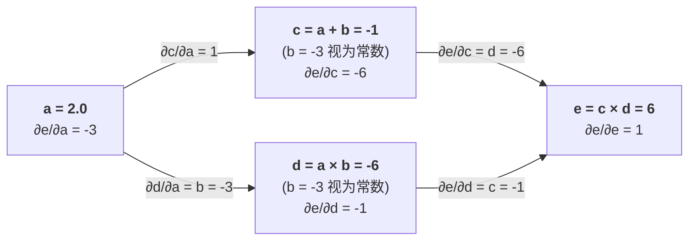

# 第 0 幕：30 行代码里的反向传播

> **本幕目标**：不看 PyTorch、不看 NumPy，只用纯 Python，写一个能"自己求导"的标量类。然后用它训练一个神经网络学会异或。读完这一幕，你会第一次亲眼看见梯度是怎么从输出"流"回参数的。

## 1. 一个被问烂的问题：什么是反向传播？

几乎每本深度学习教材都会告诉你："反向传播就是链式法则。"这句话没错，但它像在说"飞机就是会飞的铁"——你知道了答案，还是不会造飞机。

我们换一个角度问：**一个程序，怎么知道自己每一行代码该背多少锅？**

假设你写了这么一段代码：

```python
a = 2.0
b = -3.0
c = a + b            # c = -1.0
d = a * b            # d = -6.0
e = c * d            # e = 6.0
```

现在我们想知道：如果让 e 变大一点点，a 该往哪个方向调？调多少？

这就是下面这个偏导。手算：$\frac{\partial e}{\partial a}$，

其中 $\frac{\partial e}{\partial c} = d = -6$ $\qquad \frac{\partial e}{\partial d} = c = -1$  $\frac{\partial c}{\partial a} = 1$  $\qquad \frac{\partial d}{\partial a} = b = -3$

链式法则把它们拼起来：

$$\frac{\partial e}{\partial a} = \frac{\partial e}{\partial c}\cdot\frac{\partial c}{\partial a} + \frac{\partial e}{\partial d}\cdot\frac{\partial d}{\partial a} = (-6)(1) + (-1)(-3) = -3$$

关键观察：**反向传播不需要重算一遍，它只依赖三件事**。把计算图画出来，这三件事一目了然：

1. **记录前向依赖**——每个中间变量都记得"我是用哪几个数、通过什么运算得到的"（图上的箭头就是依赖关系）。
2. **记录输入是谁**——每个节点都留着自己的两个父母，反向时才能把梯度"还回去"。
3. **分支要累加**——一个输入可能通过多条路径影响输出。比如 a 既走 c=a+b 这条路，又走 d=a·b 这条路对 e 有贡献，两条路的梯度必须相加。



图里只追踪对 a 的偏导。a 通过 c 这条路贡献 $1 \times (-6) = -6$，又通过 d 这条路贡献 $(-3) \times (-1) = 3$，两条路相加得：

$$\frac{\partial e}{\partial a} = -6 + 3 = -3$$

边上标的就是这个算子对父节点的偏导。

这就是反向传播。没有任何魔法。

现在才能回答一开始那个问题：**让 e 变大一点点，a 该往哪走？走多远？**

答案就藏在这个负数里：

$$\frac{\partial e}{\partial a} = -3$$

- **符号 = 方向**。导数为负，意味着 a 增大时 e 反而减小。所以要让 e 变大，a 必须往**小**走。
- **绝对值 = 敏感度**。a 每动 1 个单位，e 大约反向动 3 个单位；这次 a 动了 -0.03，所以 e 大约正向动：

$$3 \times 0.03 = 0.09$$

写成一步"梯度上升"就是（η 是你选的步长，比如 0.01）：

$$a_{\text{new}} = a + \eta \cdot \frac{\partial e}{\partial a} = 2 + 0.01 \times (-3) = 1.97$$

我们验证一下：a 从 2 变到 1.97，也就是 Δa = -0.03。线性近似预测：

$$\Delta e \approx \frac{\partial e}{\partial a}\Delta a = (-3)\times(-0.03) = +0.09$$

即 e 应涨到约 6.09。

实际重算：

$$e = (a+b)(a \cdot b) = (1.97 - 3)(1.97 \times -3) = (-1.03)(-5.91) = 6.0873$$

实际涨幅 0.0873，和预测的 0.09 差不到千分之三——线性近似确实够用。剩下那点误差，就是泰勒展开里被我们扔掉的二阶项。

> **这就是"训练"的全部本质**：梯度的**符号**告诉你往哪边走，**绝对值**告诉你敏感度，剩下的只是一个你自己定的步长 η。损失函数要减小、所以用**梯度下降**（公式里把加号改成减号）；逻辑一字不改。

这就是反向传播。没有任何魔法。

## 2. 把这个观察写成类：Value

我们要做的事，用一句话概括：**让每个运算在做前向的时候，顺手登记一个"事后怎么还梯度"的函数。**

```python
# core/value.py —— 整个 zerotorch 的第一块基石

class Value:
    def __init__(self, data, _parents=(), _op=''):
        self.data = data                  # 这个节点存的数值
        self.grad = 0.0                   # 输出对这个节点的梯度（上游传来的"锅"）
        self._backward = lambda: None     # 生成我的那个运算的反向函数
        self._parents = set(_parents)     # 我的父母：是谁算出了我

    def __add__(self, other):
        other = other if isinstance(other, Value) else Value(other)
        out = Value(self.data + other.data, (self, other), '+')

        def _backward():
            self.grad  += out.grad * 1.0
            other.grad += out.grad * 1.0
        out._backward = _backward
        return out

    __radd__ = __add__

    def __mul__(self, other):
        other = other if isinstance(other, Value) else Value(other)
        out = Value(self.data * other.data, (self, other), '*')

        def _backward():
            self.grad  += out.grad * other.data
            other.grad += out.grad * self.data
        out._backward = _backward
        return out

    __rmul__ = __mul__

    def __sub__(self, other):
        out = Value(self.data - other.data, (self, other), '-')
        def _backward():
            self.grad  += out.grad * 1.0
            other.grad += out.grad * -1.0
        out._backward = _backward
        return out

    def relu(self):
        out = Value(0 if self.data < 0 else self.data, (self,), 'ReLU')

        def _backward():
            self.grad += (out.data > 0) * out.grad
        out._backward = _backward
        return out

    def __pow__(self, k):
        out = Value(self.data ** k, (self,), f'**{k}')

        def _backward():
            self.grad += k * (self.data ** (k - 1)) * out.grad
        out._backward = _backward
        return out
```

> [!NOTE]
> **最容易搞混的一点：`.grad` 到底是谁对谁的偏导？**
>
> 假设 c = a + b，那么 `c.grad` 存的是输出对 c 的梯度：
>
> $$\frac{\partial e}{\partial c} = -6$$
>
> **不是** $\frac{\partial c}{\partial a}$。
>
> 规则只有一条：**每个节点的 `.grad` 永远是"输出对我"的偏导**，即上游传来的梯度。至于 $\frac{\partial c}{\partial a} = 1$ 这个"c 对自己输入"的偏导，它**不存下来**——它是在 `c._backward()` 内部当场乘上去的系数：拿到 `out.grad`（也就是 ∂e/∂c），乘以 ∂c/∂a，累加到 `a.grad`。
>
> 一句话：`.grad` 是"上游怎么看我"，算子内部那一步乘的是"我怎么看我的输入"。两者相乘，才是链式法则。

> [!NOTE]
> **对应地，`self._backward` 是谁的反向？**
>
> 它是**生成 self 的那个运算**的反向函数，不是 self 作为输入参与的下游运算。举例：
>
> - `c = a + b` → `c._backward` 是**加法**的反向：把 `c.grad` 原样分给 a 和 b。
> - `e = c * d` → `e._backward` 是**乘法**的反向：把 `e.grad` 乘以 `d` 分给 c，乘以 `c` 分给 d。
>
> 调用时从 e 往回走：先执行 `e._backward`（把 e.grad 拆给 c、d），再执行 `c._backward`（把 c.grad 拆给 a、b）。每个节点只负责"我是怎么被算出来的"那一步。

> [!NOTE]
> **为什么调用 `d._backward()` 会更新 a 和 b 的 grad？——Python 闭包**
>
> 看这段代码：
>
> ```python
> def __mul__(self, other):
>     out = Value(self.data * other.data, (self, other), '*')
>     def _backward():
>         self.grad  += out.grad * other.data
>         other.grad += out.grad * self.data
>     out._backward = _backward
>     return out
> ```
>
> 执行 `d = a * b` 时，`__mul__` 被调用，此时现场是：`self=a`、`other=b`、`out=d`。定义 `_backward` 这个嵌套函数时，Python 的**闭包**机制让它"记住"了当时的 `self`、`other`、`out`——即使 `__mul__` 已经执行完，这三个对象也不会被销毁，因为 `_backward` 还引用着它们。
>
> 把 `_backward` 赋给 `d._backward`，相当于在 d 身上挂了一个"信封"，信封里装着 a 和 b 的引用。后面调用 `d._backward()` 时，执行的就是这个闭包：里面的 `self` 还是 a，`other` 还是 b——所以 `a.grad` 和 `b.grad` 都被更新了。
>
> 一句话：`_backward` 不是普通函数，它是一个"出生时就认识了 a、b、d"的闭包。

请花五分钟逐行读这段代码。它只有五个方法，但每一行都在做一件你刚才能手算的事：

| 代码 | 它在说什么 |
|---|---|
| `self.data` | 前向算出来的值 |
| `self.grad` | 这个节点对最终输出的偏导，初始为 0 |
| `_backward` | 闭包。前向时先记着，反向时才调用 |
| `self.grad += ...` | 注意是 `+=`，因为一个节点可能被用多次 |

## 3. 为什么需要拓扑排序？

现在我们有了每个节点的 `_backward`。但调用顺序有讲究：**必须先算儿子的 grad，再算爷爷的 `_backward`**，否则爷爷那一步读到的还是 0。

换句话说，我们要把计算图从输出往输入走一遍。这就是拓扑排序。

```python
# Value.backward —— 整个 autograd 的心脏

def backward(self):
    # 1. 先拓扑排序：从 self 出发，沿父母方向往上
    topo = []
    visited = set()
    def build(v):
        if v not in visited:
            visited.add(v)
            for parent in v._parents:
                build(parent)
            topo.append(v)
    build(self)

    # 2. 输出自己的梯度是 1（dL/dL = 1）
    self.grad = 1.0

    # 3. 倒着走拓扑序，调用每个节点的 _backward
    for v in reversed(topo):
        v._backward()
```

把 `backward` 方法挂回 `Value` 类上即可。记住这个模式：**拓扑序 + 反向遍历 + 每个节点只做自己那一步链式法则**。在 zerotorch 里，无论后来的 Tensor、Conv2d、Attention 多复杂，心脏永远是这三行。

## 4. 验证一下：手算对得上吗？

用第 1 节那个例子：

```python
# examples/01_manual_check.py

from zerotorch.core.value import Value

a = Value(2.0)
b = Value(-3.0)
c = a + b
d = a * b
e = c * d
e.backward()

print(a.grad)   # 期望 -3.0，手算过
print(b.grad)   # 期望  4.0
```

跑一下：`a.grad == -3.0`，和我们手算的一模一样。这时候你已经写了一个能用的 autograd 了。

> **自检问题**（答不上来就回去重读第 2 节）：
> 1. 为什么 `__mul__` 里给 `self.grad` 加的是 `out.grad * other.data`？
> 2. 为什么 `__add__` 里两边都是 `out.grad * 1.0`？
> 3. 为什么用 `+=` 而不是 `=`？

## 5. 升级：用它训练一个会异或的神经网络

现在的 `Value` 还很弱（不能批量、不能矩阵），但足够搭一个最小 MLP 学 XOR。我们定义神经元和层：

```python
# examples/01_xor_with_value.py

import random

from zerotorch.core.value import Value

class Neuron:
    def __init__(self, n_in):
        self.w = [Value(random.uniform(-1, 1)) for _ in range(n_in)]
        self.b = Value(0.0)
    def __call__(self, x):
        act = sum((wi * xi for wi, xi in zip(self.w, x)), self.b)
        return act.relu()
    def parameters(self):
        return self.w + [self.b]

class Layer:
    def __init__(self, n_in, n_out):
        self.neurons = [Neuron(n_in) for _ in range(n_out)]
    def __call__(self, x):
        return [n(x) for n in self.neurons]
    def parameters(self):
        return [p for n in self.neurons for p in n.parameters()]

class MLP:
    def __init__(self, n_in, outs):
        sz = [n_in] + outs
        self.layers = [Layer(sz[i], sz[i+1]) for i in range(len(outs))]
    def __call__(self, x):
        for layer in self.layers:
            x = layer(x)
        return x[0]
    def parameters(self):
        return [p for layer in self.layers for p in layer.parameters()]
```

训练循环——也就是 PyTorch 里那个 `for epoch in ...: loss.backward(); opt.step()` 的裸奔版本：

```python
model = MLP(2, [4, 4, 1])   # 2 输入，两个隐层各 4 个神经元，1 输出
data = [([0,0], 0), ([0,1], 1), ([1,0], 1), ([1,1], 0)]

for k in range(200):
    # 前向：算 loss（这里用最简单的 (pred - y)^2）
    total = Value(0.0)
    for x, y in data:
        pred = model(x)
        total = total + (pred - Value(float(y))) ** 2

    # 清零梯度（注意：必须每步清零，否则会累加）
    for p in model.parameters():
        p.grad = 0.0

    # 反向
    total.backward()

    # 梯度下降：沿着梯度反方向走一小步
    for p in model.parameters():
        p.data -= 0.05 * p.grad

    if k % 20 == 0:
        print(f"step {k:3d}  loss = {total.data:.4f}")
```

跑起来，你会看到 loss 从 1.x 一路降到接近 0。一个用你自己写的 autograd 驱动的神经网络，刚刚学会了异或。

## 6. 这一幕的局限（也是下一幕的引子）

现在停一下，诚实地审视一下这个 `Value`：

1. **它只能标量**。真实的权重是矩阵，一次 forward 要做几百万次 Python 循环，慢到不可用。
2. **它没有形状概念**。等我们要写 Conv2d、Attention 时，广播、reshape、transpose 的梯度怎么算？
3. **它的 `_backward` 是闭包**。每个运算都写一个闭包，重复但啰嗦；真实框架里我们希望"一个算子一个类"。
4. **它每次都重新建图**。训练循环里每个 step 都 build 一遍 topo——这其实没问题，但要意识到这是"动态图"。

这些局限不是 bug，它们就是下一幕要解决的问题。我们要做的下一步，是把 `Value.data` 从一个浮点数换成一个 NumPy 数组，把 `_backward` 从闭包换成一个 `Function` 对象——但**那三行核心逻辑（拓扑序、反向遍历、每个节点算自己的链式法则）一行都不会变**。

> **本幕带走的三件事**：
> 1. 反向传播 = 前向时登记一个"还梯度"的闭包，反向时按拓扑序调用它们。
> 2. 每个算子的反向，就是你手算该算子偏导的那几行代码。
> 3. 梯度必须 `+=`，每步训练前必须 `zero_grad`。

## 7. 作业（动手才算数）

1. 给 `Value` 加上 `__radd__`、`__truediv__`、`tanh`，每个都先手写偏导再写代码。
2. 写一个函数 `numerical_check(f, x, eps=1e-5)`，用中心差分对比你写的解析梯度：

$$\frac{f(x+\varepsilon)-f(x-\varepsilon)}{2\varepsilon}$$

这是你以后写每个新算子时的编译器。
3. 把学习率从 0.05 改成 0.5，观察 loss 发散；再改成 0.001，观察收敛变慢。这就是超参数直觉的起点。

---

**下一幕预告**：《把 Value 换成 Tensor —— NumPy 给我们装上了翅膀》。我们会引入真正的矩阵运算，并第一次直面"形状"这个反向传播里最阴险的题目。
